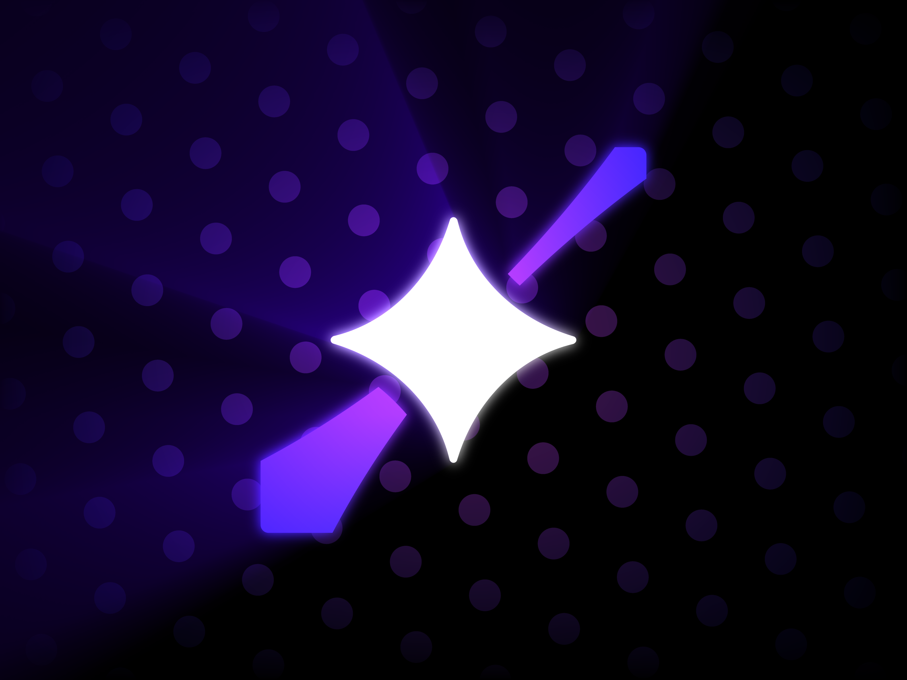

# Home

##    Welcome to the Starlight Wiki!

<a href="info/people/" class="button primary">People</a>  <a href="info/other/" class="button primary">Other</a>  <a href="resources/" class="button primary">Resources</a>  <a href="rr/rooms/" class="button primary">Rooms</a>  <a href="rr/invs/" class="button primary">Inventions</a>  <a href="mc/serv/" class="button primary">Servers</a>  <a href="mc/cli/" class="button primary">Clients</a>

This is the place to find information about all things Starlight, quickly and easily! You can switch between pages using the table of contents, and search using the search bar!


This wiki is in heavy development, and pages will move places a lot! Links may break over time!


Why would I care?

You can find a lot of useful stuff here, and also learn about stuff you have never heard before!

## How to make games like Starlight



### Prototype

Make a basic demo of your game, get your ideas out quicker



### Playtest

Start testing as early as you can, flush out bugs before they get to your players



### Publish

Get it out there and let it flourish



and remember.. It isn't quality that makes a game popular. It isn't bucketloads of cash. Its gameplay, soul, and most importantly, fun, that determines if your games will succeed. We learned that the hard way.


and in rec room's case, a lot of luck.

