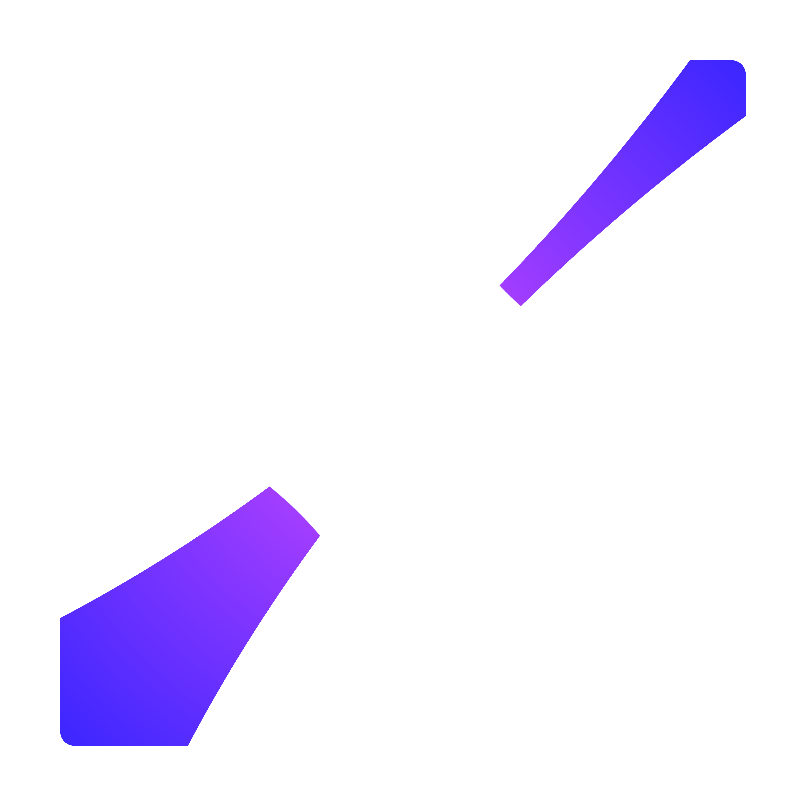
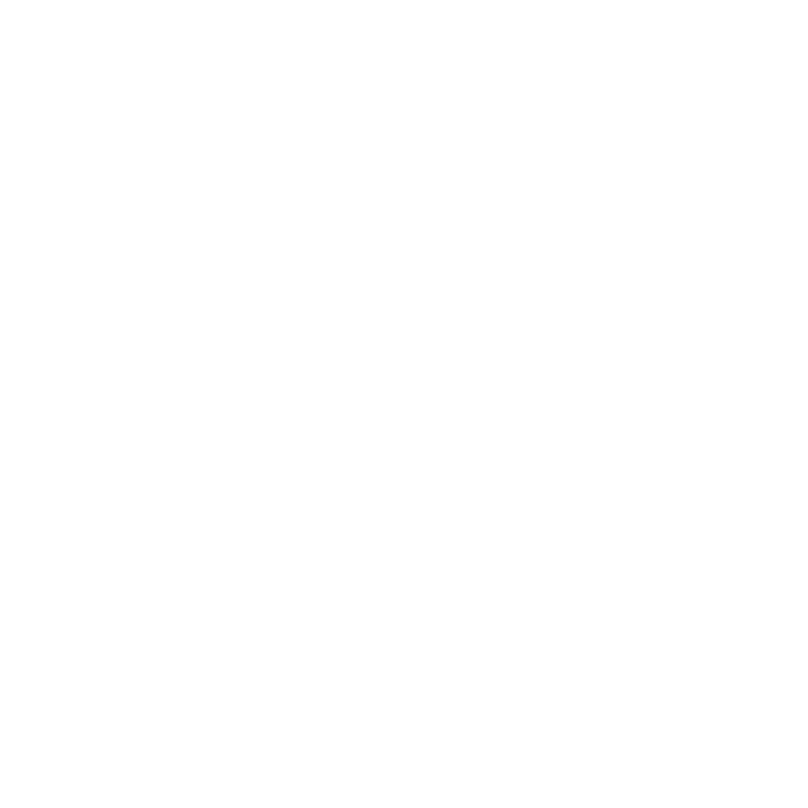
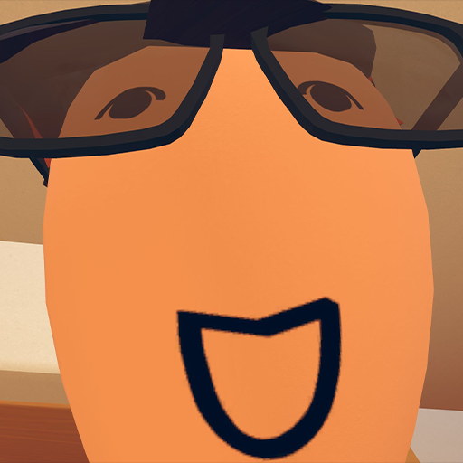

# Branding



##   Starlight

Starlight is a version of our branding made during mid 2025. It depicts a star, with light rays coming down around it, completely reinventing the previous logo. It was entirely made in ibisPaintX.

## Usage Guidelines

This branding is being used actively, and a press pack download is available below. Here are some things you can do with our assets:

* Making a video, article, or other piece of content covering Starlight, and its creations
* Crediting Starlight for assets or inspiration in a game you or others have made

On the other hand, here are some things you definitely CANNOT do with our assets:

* Impersonate Starlight
* Spread misinformation about Starlight (this does not include critique of Starlight, just the fake stuff)

If these usage guidelines are unclear, or you have a use case that you do not believe is covered, please let us know in our discord server! We are happy to fit your use case, as long as it is in good faith. (and yes, critiquing us and the things we do is allowed!)

Also, you should note that not all assets in our press pack is made by us. Our press pack also includes a few assets that we have not created ourselves, with their own licenses and usage guidelines.  These assets are:

* Afacad Flux Font

## Pack specifics

Some more information about general guidelines can be found in the Starlight\_Branding\_Sheet.png file. This sheet is not guaranteed to be updated over time, so please look at [#branding-guidelines](branding.md#branding-guidelines "mention") for up to date information about the best practices when using our pack.

All files in this pack start with Starlight\_ for easy identification. This allows them to be easily searched in a global search scenario, such as in Unity. We use this pack for our branding too!

Most image assets in this pack are made with IbisPaintX. In the future, we may remake these assets using a different program, in vector format.

## Branding Guidelines

Use Afacad Flux as the brand font.

Use lots of gradients, and either use the Monochrome or Colored color palette.

Use concentric gradients if possible.

Use hexagon dot grids, especially in places like backgrounds.

Use rounded corners where possible. Sharp corners can be used on some places, though.

### Colored Colors

\#C445FF (Brighter Gradient)

\#2B23FF (Darker Gradient)

### Monochrome Colors

\#A2A2A2 (Brighter Gradient)

\#2C2C2C (Darker Gradient)

## Pack Download

_download is not available just yet, check back later_



##   Starlight

Starlight was a version of our branding that was around during the lifespan of Wand Arena. It is an iteration on our previous logo, with the sides chopped off. Although it meant to depict light coming down between two corners, it ended up looking more like an arrow in the final product. It was entirely made in ibisPaintX.

## Usage Guidelines

This branding is still used in Wand Arena and other projects created around the same time, and due to its age, we will not be providing a press pack with it (unless specifically requested). If you get hold of any of these assets regardless, you are not permitted to use them, unless you are creating content related to Starlight.&#x20;

PS: Do not use our assets to impersonate us.



## .png>)  Starlight Studios

Starlight Studios was a version of our branding that was around during the lifespan of Ability Cubes. It was only designed in black, and was depicting a ray coming down inside of a square box. It was entirely made in ibisPaintX.

## Usage Guidelines

This branding is still used in Ability Cubes, and due to its age, we will not be providing a press pack with it. If you get hold of any of these assets regardless, you are not permitted to use them, unless you are creating content related to Starlight.&#x20;

PS: Do not use our assets to impersonate us.



##   Shard

Shard was a version of our branding that was around during the lifespan of Better Freeze Tag. It depicts a crystal rock, and was entirely made using maker pen shapes.

## Usage Guidelines

This branding is completely out of date and not being used in any projects, so you are free to do what you want with it.



##   Slice

Slice was a version of our branding that was around during the lifespan of Slice Hub and Slice AMAs. It depicts a sphere being sliced into two halves, and was entirely made using maker pen shapes.

## Usage Guidelines

This branding is completely out of date and not being used in any projects, so you are free to do what you want with it.



##   4 Corners

4 Corners was a version of our branding that was around during the lifespan of the 4rest. It depicts 4 corners of a cube split apart, with one corner being further away than every other. It was entirely made using maker pen shapes.

## Usage Guidelines

This branding is completely out of date and not being used in any projects, so you are free to do what you want with it.



